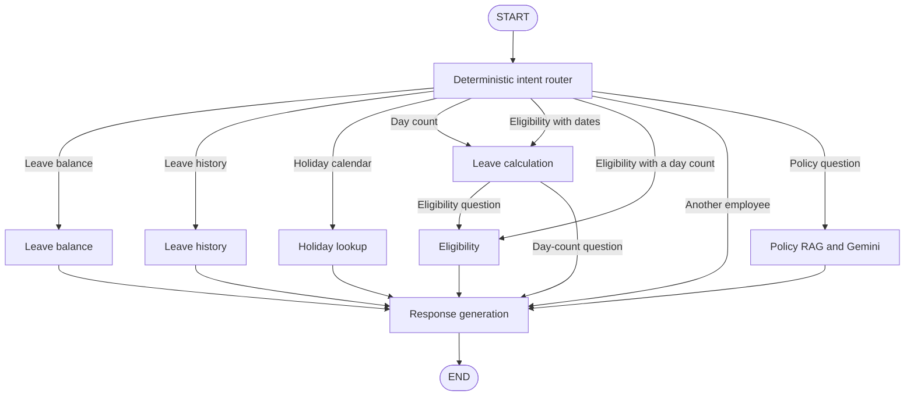

# HR Chat Agent

Employees sign in and ask questions about company leave policy and their own leave records. Policy answers come from the supplied HR policy PDF. Leave balances, day counts, and eligibility are calculated by deterministic Python tools. A LangGraph workflow decides which of those tools a message needs.

The employee and leave rows in the local database are fictional demo data. Policy answers are grounded in the supplied documents in `policies/`: `Revised Leave Policy - I2I.pdf` and `Holiday List - 2026.pdf`. The application reads those files as supplied and does not modify them.

## Problem

An employee needs one place to ask what the leave policy says, what their own balance is, how many days a date range will deduct, and whether a request fits that balance. The assistant must not invent rules, must not calculate leave itself, and must not reveal another employee's records.

## Architecture



LangGraph is the workflow. `select_intent` is a deterministic router: keyword and date parsing choose the tool path before any model call. Balance, history, holiday, calculation, and eligibility nodes call the existing Python tools and write the reply from those results. Only an unstructured policy question enters `policy_retrieval`, which retrieves PDF passages and asks Gemini to phrase the answer.

If that Gemini call fails because the free-tier quota is exhausted, the policy node returns: "The policy knowledge service is temporarily unavailable because the configured LLM quota has been reached. Database and leave-management tools are still available." It does not invent a policy answer, and it does not show the provider exception. Leave, holiday, and eligibility questions keep working because they never call Gemini.

Streamlit authenticates the employee and keeps the chat in `st.session_state`. Each new message is passed to `run_agent` with that session employee. The router does not let the model choose an employee id.

See [architecture.md](architecture.md) for component responsibilities.

## LangGraph workflow

The compiled graph is in `agent/graph.py`.

| Node | What it does |
| --- | --- |
| `select_intent` | Deterministic router. Classifies the message from the current text and the previous turn. Refuses another employee's private data before any tool or model call. |
| `policy_retrieval` | The only Gemini step. Retrieves policy passages and asks the model to answer from those passages. A quota failure becomes the unavailable message above. |
| `leave_balance` | Reads the signed-in employee's balances. |
| `leave_history` | Reads the signed-in employee's leave requests. |
| `holiday_lookup` | Reads the official 2026 company holidays from SQLite. |
| `leave_calculation` | Counts chargeable days from the start date through the end date. |
| `eligibility` | Checks the signed-in employee's remaining balance and the policy constraints. Date-based questions pass through leave calculation first. |
| `respond` | Formats the tool result. It does not call Gemini. |

Conversation follow-ups such as "What about sick leave?" and "What about 5 days?" use the previous turn stored in the Streamlit session. Logout clears that history. A different signed-in employee does not inherit the previous chat.

## Authentication and security

- Employees sign in with an employee code and password. Passwords are stored as PBKDF2-HMAC-SHA256 hashes.
- The signed-in record, including the internal database id, lives in `st.session_state["employee"]`.
- `run_agent(message, employee, history)` receives that record from the application. Leave tools are called with `employee["id"]`.
- `employee_id` is not a tool argument the model can fill in. There is no employee-id field in the chat.
- A request such as "Show Vismitha's leave balance" or "What is EMP002's leave history?" is refused with: "I can only access HR information associated with your authenticated employee account."
- Asking about the signed-in employee's own code still reads only that account.
- General policy questions do not query the employee database.

## RAG

`python -m rag.ingest` chunks every PDF in `policies/` into the existing Chroma collection in `chroma_db/`. That includes the leave policy and `Holiday List - 2026.pdf`. `search_hr_policy` retrieves passages. `answer_policy_question` sends only the question and those passages to Gemini, with instructions to answer from that context or to say the information was not found. Citations include the PDF name and page when the retriever has one.

Employee balances are not sent to Gemini.

## Tools

| Tool | Function | Used for |
| --- | --- | --- |
| Policy Search | `search_hr_policy` | Policy questions. Gemini phrases the retrieved text. |
| Leave Balance | `get_leave_balance` | The signed-in employee's entitled, used, and remaining days. Remaining is `entitled - used`. |
| Leave History | `get_leave_history` | The signed-in employee's requests only. |
| Leave Calculator | `calculate_leave_days` | Calendar days minus public holidays that fall inside the range. |
| Holiday Lookup | `get_holidays` | Official company holidays for a year or month. |
| Eligibility Checker | `check_leave_eligibility` | Leave type, positive days, and remaining balance, plus rules quoted from the PDF. |

Holiday lookup reads SQLite. Those rows are loaded from `Holiday List - 2026.pdf`. A passing eligibility result is not manager approval.

## Database

SQLite file: `database/hr_chat.db` (gitignored). `python -m database.seed` reloads canonical demo balances without recreating existing employee identities.

Casual Leave, Sick Leave, and Earned Leave entitlements in the seed match the PDF: 6, 6, and 12 days per calendar year. Privilege Leave has no annual grant in the PDF, so PL rows are sample retained balances. Used days are sample database data. The 2026 company holidays are the 12 dates in `Holiday List - 2026.pdf`.

Demo employees, all with password `Demo@123`:

| Employee ID | Name | Department |
| --- | --- | --- |
| EMP001 | Khavish | Engineering |
| EMP002 | Vismitha | Finance |
| EMP003 | Viji | HR |

EMP001's 2026 Casual Leave demo balance is 6 entitled, 2 used, 4 remaining.

## Policy grounding

These rules are implemented because the supplied PDF states them:

- Casual Leave is 6 days per calendar year and is not carried forward or encashed (sections 4.1, pages 1–2; FAQ 4, page 9).
- Sick Leave is 6 days per calendar year and is not carried forward or encashed (sections 4.2, pages 1–2; FAQ 5, page 9).
- Earned Leave is 12 days per calendar year, with limited carry-forward (sections 4.3, pages 1–2; FAQ 6–7, page 9).
- A declared public holiday or a weekly off inside an approved leave period is not counted as leave (section 7.3, page 8; FAQ 19, page 11).
- Leave must be requested in advance and approved by the reporting manager (section 7.1, page 7; FAQ 15, page 10).

Saturday and Sunday are weekly offs because the office is closed on those days. The calculator does not count them as leave. It does not state a sandwich rule or a maximum number of consecutive Casual Leave days. Those limits are not applied.

## Conversation context

The chat transcript and a small context object (intent, leave type, dates, requested days) stay in the Streamlit session for the signed-in employee. Follow-up questions use that context when the new message is short, for example "What about sick leave?" after a balance question. Logout, and signing in as someone else, clears it. History is not written to disk.

## Setup

Python 3.11 or newer is required.

```bash
python3 -m venv .venv
source .venv/bin/activate
pip install -r requirements.txt
cp .env.example .env
```

Put your Gemini API key in `.env` as `GOOGLE_API_KEY`. Do not commit `.env`.

```bash
python -m database.seed
python -m rag.ingest
streamlit run app.py
```

Sign in as `EMP001` / `Demo@123`. Example questions are shown in the chat and are not submitted automatically:

- What is my Casual Leave balance?
- What is the Casual Leave policy?
- Can I take Casual Leave from 24 Jan to 27 Jan 2026?
- Show my leave history.

The chat shows only the answer. `run_agent` still returns the names of the tools that ran, and the tests check them. A Developer Demo expander still exposes the direct leave-tool buttons for the signed-in employee.

Run the local tests, which do not call Gemini:

```bash
python -m unittest tests.test_leave_tools tests.test_agent -v
```

## Gemini free-tier configuration

Model names live in `rag/config.py`.

- Embeddings: `gemini-embedding-2`
- Policy answers: `gemini-3.7-flash`

`gemini-2.5-flash` is not available to new keys. `gemini-3.8-flash` is available, but its free-tier daily cap is small, so policy answers use 3.7 Flash with `temperature=0` and `thinking_budget=0`.

Routing, balances, history, holidays, day counts, and eligibility do not call Gemini. A policy question uses one embedding search and one chat completion. If that quota is exhausted, the chat says the policy knowledge service is temporarily unavailable and the database tools remain usable. Deterministic HR operations are intentionally independent of LLM availability.

## Limitations

- Weekly offs are described in the PDF but the weekdays are not defined, so they are not excluded. The answer says so.
- Saturday and Sunday are weekly offs and are not chargeable. A public holiday on a weekday is also excluded.
- Privilege Leave balances are sample retained data, not a new annual entitlement.
- The database has no notice-period flag, so that policy restriction is not applied.
- No salary, payroll, or approval-workflow tools exist. Eligibility is not an approved leave request.
- Chat memory lasts only for the current signed-in session.
- Policy answers depend on the Gemini free tier and on the local Chroma index. When the quota is exhausted, policy questions stop and the leave and holiday tools continue. The agent does not substitute a guessed policy answer.

## Project structure

```
hr-chat-agent/
├── app.py
├── agent/
│   ├── graph.py
│   ├── intent.py
│   ├── prompts.py
│   └── state.py
├── tools/
│   ├── policy_search.py
│   ├── leave_balance.py
│   ├── leave_calculator.py
│   ├── eligibility.py
│   ├── holidays.py
│   └── policy_rules.py
├── rag/
│   ├── answer.py
│   ├── ingest.py
│   └── retriever.py
├── database/
│   ├── db.py
│   └── seed.py
├── policies/
│   └── Revised Leave Policy - I2I.pdf
└── tests/
    ├── test_leave_tools.py
    ├── test_agent.py
    └── check_policy_rag.py
```

## Technology stack

- Python 3.11+
- Streamlit
- LangGraph
- LangChain
- Google Gemini API (`langchain-google-genai`)
- SQLite
- ChromaDB
- pypdf
- python-dotenv
