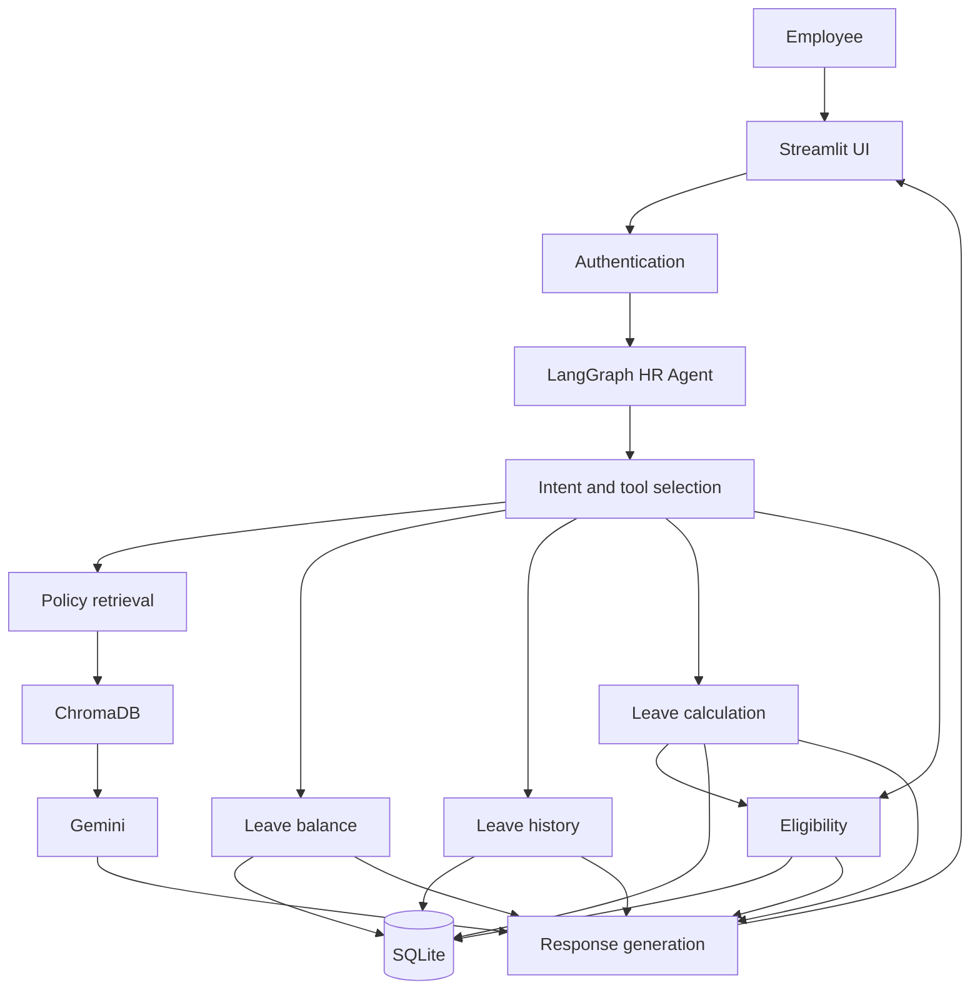

# Architecture

An employee uses the Streamlit app. Authentication stores their identity in the session. Each chat message is sent to the LangGraph agent with that identity and the session history. A deterministic router selects the tool path. Gemini is used only to write policy answers from retrieved PDF passages. Balances, history, holidays, day counts, and eligibility do not call Gemini, so they still answer when the model quota is exhausted. A failed policy call returns a short unavailable message and does not invent policy text. The model does not choose the employee id.

Policy retrieval is the only path that calls Gemini. Balance, history, calculation, and eligibility answers are formatted from tool results when the Gemini quota is unavailable.

## Responsibilities

### Streamlit UI

`app.py` renders sign-in, the chat transcript, and the message box. It keeps the authenticated employee and the message history in session state. Logout clears both. The chat calls `run_agent` with `st.session_state["employee"]`. A Developer Demo expander can call the leave tools directly for that same employee. The UI has no field for another employee id.

### Authentication

`database/db.py` checks the employee code and password and returns the public employee fields, including the internal id. That id is the only employee identifier the tools accept. A message that names another employee or another employee code does not change it.

### LangGraph agent

`agent/graph.py` compiles the workflow. `agent/state.py` holds the message, session history, authenticated employee, tool results, and reply. `agent/intent.py` classifies the turn. `agent/prompts.py` holds the refusal and the employee-facing notes that the response node uses.

The graph orchestrates tool calls. Leave arithmetic and eligibility rules stay in `tools/`.

### Gemini

Gemini embeds policy chunks and phrases policy answers. The chat model and embedding model are named in `rag/config.py`. The API key is `GOOGLE_API_KEY`, loaded from the environment, and is not stored in source control.

### Policy RAG

`rag/ingest.py` indexes documents in `policies/`. `rag/retriever.py` returns passages. `tools/policy_search.py` exposes `search_hr_policy`. `rag/answer.py` asks Gemini to answer from those passages and to say when the documents do not contain the answer. Citations include the file name and page.

### SQLite

`database/db.py` defines employees, leave types, leave balances, leave requests, and holidays. `database/seed.py` loads fictional demo employees and sample leave activity. Entitlements that the supplied leave PDF states explicitly are aligned with that PDF. The 2026 holiday rows are the official dates from `Holiday List - 2026.pdf`. Privilege Leave balances and used days are sample data.

`get_leave_balance` and `get_leave_history` query only the employee id supplied by the session.

### Business-rule tools

`calculate_leave_days` counts inclusive calendar days and excludes public holidays stored in SQLite, because section 7.3 of the supplied leave PDF says a public holiday inside the leave period is not counted. The holiday dates come from `Holiday List - 2026.pdf`. That list says mandatory leave is enforced on Saturdays and Sundays. The leave policy says weekly offs are not counted, but neither document defines a weekly off as Saturday or Sunday, so those days are not removed and the result includes that warning. `get_holidays` answers factual calendar questions from SQLite.

`check_leave_eligibility` checks that the leave type exists, the request is positive, and the remaining balance is sufficient. It attaches the PDF constraints for that leave type, including advance manager approval. Eligible means the verified checks passed. It does not mean the leave is approved.

## Boundary

| Concern | Owner |
| --- | --- |
| Which tool a message needs | LangGraph intent selection |
| Policy wording | Gemini, from retrieved passages only |
| Policy evidence | ChromaDB retrieval |
| Who the user is | Authentication and session |
| Balances and history | SQLite, scoped to the session employee |
| Day counts and eligibility | Python business rules |
| Chat memory | Streamlit session, cleared on logout |
