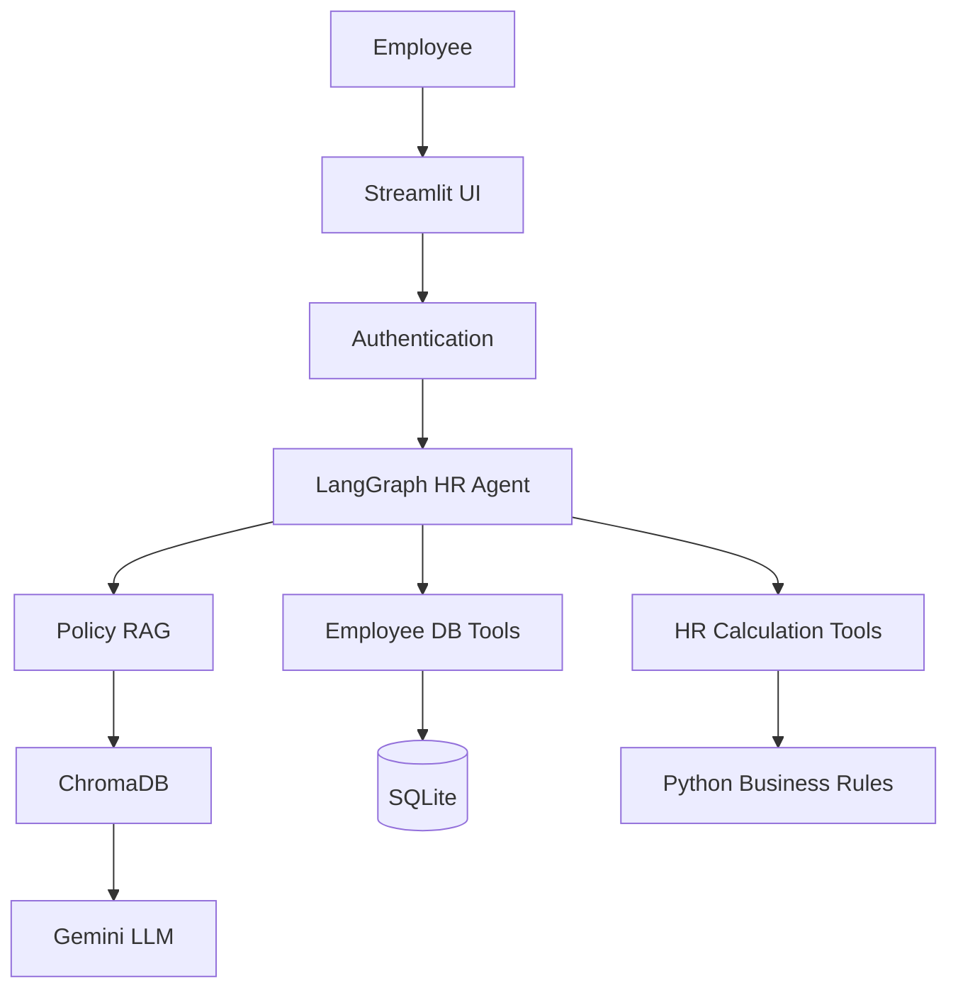

# Architecture

This document describes the intended design of the HR Chat Agent. The repository currently contains the foundation only. The components below are not implemented yet.

## Flow

An employee uses the Streamlit UI. Authentication establishes who they are and stores that identity in the session. The LangGraph agent receives the conversation and that session identity. It may search policy documents, read that employee's database rows, or call calculation tools. Gemini writes the natural-language reply. Numbers, balances, and eligibility decisions come from tools.

Gemini is also the chat model used by the LangGraph agent. The diagram follows the retrieval path into the model because policy answers must be generated from retrieved passages.

## Responsibilities

### Streamlit UI

`app.py` is the only user-facing process. It will render sign-in, the chat transcript, and the message box. It will keep the authenticated employee and the message history in session state and pass each new turn to the agent. It will not embed policy text, query SQLite, or apply leave rules itself.

### Authentication

A later step will verify an employee against the local demo database and record their identity in the Streamlit session. Every subsequent tool call that needs an employee will receive that session value from the application. The model will not be asked to supply an employee ID, and a tool argument that names a different employee will be ignored.

### LangGraph Agent

`agent/graph.py` will compile the workflow. `agent/state.py` will define the state, including messages and the authenticated employee context. `agent/prompts.py` will instruct the model to call tools when facts are required and to answer only from tool and retrieval results.

The graph's job is orchestration: decide which tool to call, pass through session identity, and turn tool outputs into a reply. It does not own leave arithmetic or eligibility rules.

### Gemini

Gemini is the language model behind the agent and the embedding model for policy ingestion. It interprets the employee question, chooses a tool when one is needed, and writes the response. It does not decide leave balances, day counts, or eligibility. Those values are inserted from tool results.

The API key is `GOOGLE_API_KEY`, loaded from the environment. It is never stored in source control.

### Policy RAG

`rag/ingest.py` will read documents from `policies/`, chunk them, embed them, and store the vectors. `rag/retriever.py` will return the passages for a question. `tools/policy_search.py` will expose that retrieval to the agent as `search_hr_policy`.

Answers about policy should quote or closely follow retrieved text. If retrieval returns nothing relevant, the agent should say the documents do not cover the question.

### ChromaDB

ChromaDB is the local vector store for policy chunks. The persist directory (`chroma_db/`) is gitignored and can be rebuilt by re-running ingestion. It holds document text and embeddings, not employee leave records.

### SQLite

`database/db.py` will define tables for employees, leave balances, and leave history. `database/seed.py` will load demo rows. `tools/leave_balance.py` will expose `get_leave_balance` and `get_leave_history`, both filtered by the session employee. Database files (`*.db`) are gitignored.

### Business-rule tools

`tools/leave_calculator.py` will implement `calculate_leave_days`. `tools/eligibility.py` will implement `check_leave_eligibility`. Both are ordinary Python functions with explicit inputs and outputs. The agent calls them and reports their results. Changing a rule means changing these functions, not the prompt.

## Boundary

| Concern | Owner |
| --- | --- |
| Wording, tool choice, conversation | Gemini via LangGraph |
| Policy evidence | ChromaDB retrieval |
| Who the user is | Authentication and session |
| Balances and history | SQLite, scoped to the session employee |
| Day counts and eligibility | Python business rules |
